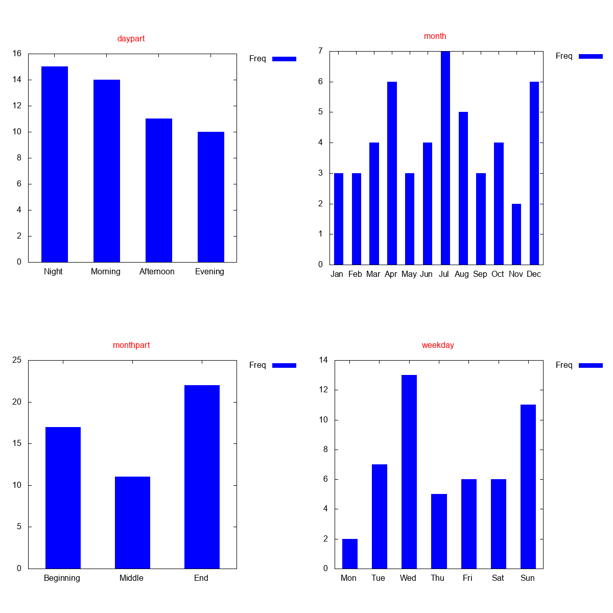
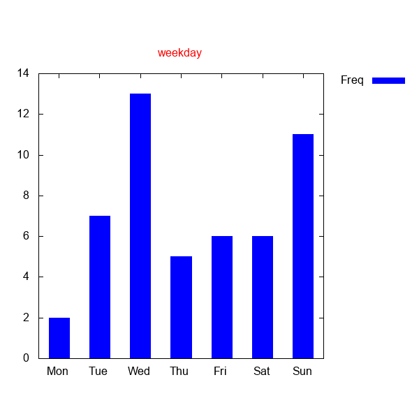

# Génération de graphiques sur `mtime`

Pour cette question, vous devez créer un script nommé `genstats` qui génère
quatre graphiques mettant en évidence les dates de dernière modification
(`mtime`) de tous les fichiers contenus dans un répertoire.

Afin de compléter cet exercice, quelques scripts vous sont fournis auxquels
vous devrez faire appel:

- `getstats`: affiche une statistique textuelle sur les valeurs `mtime` de tous
  les fichiers d'un répertoire.
- `genhist.gnuplot`: génère un histogramme de fréquences
- `gendir`: génère un répertoire contenant des fichiers horodatés manuellement
  (pour tester votre solution).

## Exemple
Lorsque vous aurez complété l'exercice, on s'attend à ce que la commande

```sh
./genstats "$(./gendir)" exemple.png
```
produise le fichier `exemple.png` diponible dans ce répertoire:



## Génération des statistiques

Le script qui génère les statistiques `mtime` se nomme `getstats`. Pour
l'utiliser, il faut entrer la commande

```sh
./getstats <statistique> <repertoire>
```

Par exemple, la commande

```sh
./getstats weekday "$(./gendir)"
```

produit le résultat suivant qui indique, pour chaque jour de la semaine, le
nombre de fichiers du répertoire `$(./gendir)` qui ont été modifiés pour la
dernière fois ce jour-là:

```
   Freq WeekDay
      2 Mon
      7 Tue
     13 Wed
      5 Thu
      6 Fri
      6 Sat
     11 Sun
```

## Génération d'un graphique

Un script Gnuplot est disponible dans le fichier `genhist.gnuplot`.  Pour
l'utiliser, vous devez d'abord installer l'application
[Gnuplot](http://www.gnuplot.info/) (elle s'installe par exemple avec `sudo apt
install gnuplot` sur Ubuntu). Le script fourni lit les données sur l'entrée
standard (`stdin`) et produit un histogramme au format png. Par exemple, la
commande

```sh
./getstats weekday "$(./gendir)" | gnuplot -e "filename='hist.png';title='weekday'" genhist.gnuplot
```

produit le fichier [`hist.png`](./hist.png) disponible dans ce répertoire, qui
représente un histogramme comptant, pour chaque jour de la semaine, le nombre
de fichiers dont la valeur `mtime` est ce jour-là.



## Assemblage de graphiques dans une matrice

Finalement, je vous rappelle qu'il est posible de regrouper plusieurs images en
une seule image à l'aide de la commande `montage` (vue dans le travail pratique
1). En particulier, l'option `-tile` vous sera utile.

## Aide

En Bash, il est possible de créer une boucle qui énumère les éléments d'une
liste de mots à l'aide des mots réservés `for`, `do`, `done`. Par exemple,
l'expression

```sh
for fruit in banane pomme "melon d'eau"; do
    echo "$fruit"
done
```

produit le résultat suivant

```
banane
pomme
melon d'eau
```

## Contraintes

Hormis les scripts fournis (`getstats`, `genhist.gnuplot`, `gendir`), seules
les commandes, `mktemp`, `rm`, `gnuplot` et `montage` sont permises
